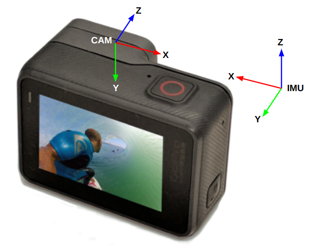
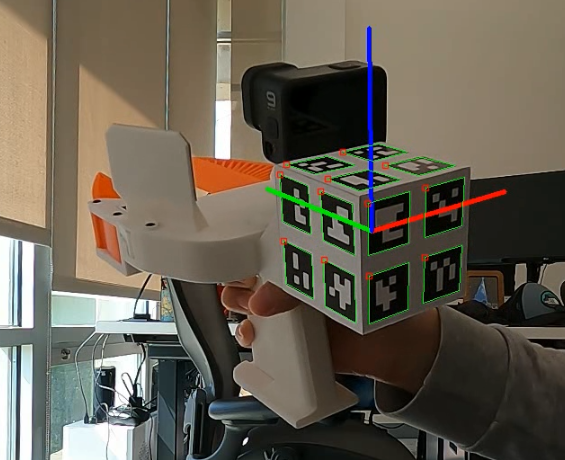

# RoboHarvest

This package estimates the state of a GoPro9 by fusing camera pose data from a visual fiducial marker with IMU data using an Extended Kalman Filter.

## Purpose

The `gopro_state_estimator` package is designed to enhance the data processing pipeline of [UMI](https://github.com/real-stanford/universal_manipulation_interface) for outdoor scenes, where background objects may be dynamic (i.e., moving). In contrast, the original ORB-SLAM3-based state estimation pipeline of UMI is optimized for static scene environments.

## Approach

The state estimation is achieved by fusing pose measurements from an ArUco cube on UMI with IMU sensor readings. This package also accounts for the additional overhead introduced by a bird's-eye view camera that tracks the fiducial marker cube. 
This repository manages the integration of these elements to provide accurate state estimation in dynamic outdoor environments.


## 🛠️ Installation (Same as [UMI](https://github.com/real-stanford/universal_manipulation_interface))
Only tested on Ubuntu 22.04

Install docker following the [official documentation](https://docs.docker.com/engine/install/ubuntu/) and finish [linux-postinstall](https://docs.docker.com/engine/install/linux-postinstall/).

Install system-level dependencies:
```console
sudo apt install -y libosmesa6-dev libgl1-mesa-glx libglfw3 patchelf
```

We recommend [Miniforge](https://github.com/conda-forge/miniforge?tab=readme-ov-file#miniforge3) instead of the standard anaconda distribution for faster installation: 
```console
mamba env create -f conda_environment.yaml
```

Activate environment
```console
conda activate umi 
```

## Additional Installations
Install DynamixelSDK

# Calibrate bird-eye view pinhole (linear) camera
Scan [this GoPro firmware QR code](assets/QR_gopro_linear_mVr1440p60e0!NfL0hS0dR0aSv1q0oV0R1L0.png), take video of checkerboard, and run:
```
python scripts/calibrate_camera.py --video_path [path_to_video.mp4]
```

# Run Data Pipeline
1. Place all video's including birdseye-view and inhand-view in a single folder (e.g. `gopro_state_estimator/data`)

2. To run data pipeline:
```console
python run_data_pipeline.py ./[path_to_demo_video_data] --mode [gripper or pruner or pruner_inverse]
```

3. Generate dataset for training.
```console
python scripts_data_processing/07_generate_replay_buffer.py -o ./[path_to_demo_video_data]/dataset.zarr.zip ./[path_to_demo_video_data]
```

4. Copy the generated `dataset.zarr.zip` to [UMI](https://github.com/real-stanford/universal_manipulation_interface) repo and train the diffusion policy.  


## Training Diffusion Policy
Single-GPU training. Tested to work on RTX3090 24GB.
```console
(umi)$ python train.py --config-name=train_diffusion_unet_timm_umi_workspace task.dataset_path=example_demo_session/dataset.zarr.zip
```

Multi-GPU training.
```console
(umi)$ accelerate --num_processes <ngpus> train.py --config-name=train_diffusion_unet_timm_umi_workspace task.dataset_path=example_demo_session/dataset.zarr.zip
```

# Other example commands
Once data is processed, 6-DOF pose can be visualized by specifying session directory:
```
python scripts/visualize_data.py [session_dir] 
```

To visualize a rollout trajectory:
```
python scripts/replay_episode.py -z [./data/path_to_zarr]
```

To generate aruco cube tracking video:
```
python scripts/example_track_aruco.py -i [path_to_mp4_file] -o [path_to_output_mp4]
```

To run EKF script:
```
python scripts/extended_kalman_filter.py -i data/demos/robot -v -o output/robot_traj.mp4
```

To combine generated videos:
```
ffmpeg -i output/robot.mp4 -i output/robot_traj.mp4 -filter_complex "[0]scale=-1:1080[a];[1]scale=-1:1080[b];[a][b]hstack" -r 30 output/robot_combined.mp4
```

# Coordinate Frames
<p align="center">
  
  
</p>

# Useful Links
- [OpenImuCameraCalibrator](https://github.com/urbste/OpenImuCameraCalibrator): GoPro Calibration (frames and syncs)
- [gpmf_parser](https://gopro.github.io/gpmf-parser/): IMU Frame